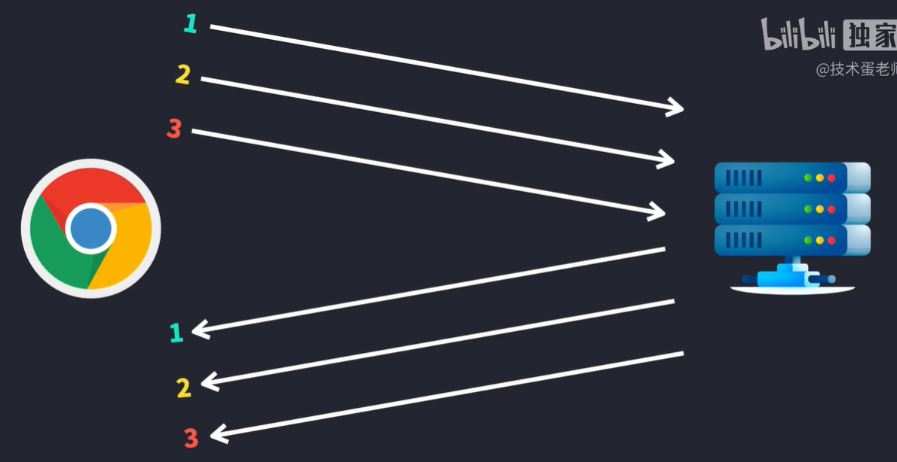
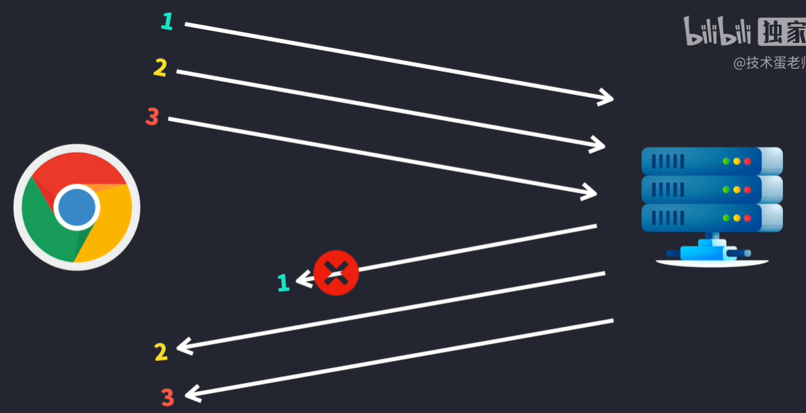
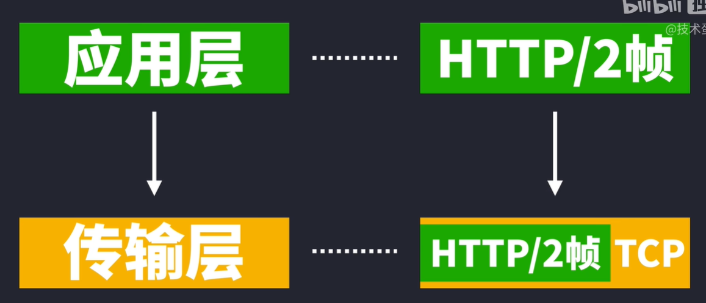
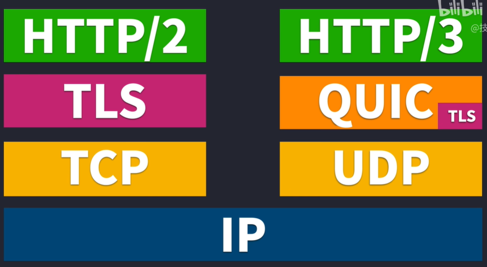

# 1. HTTP全称

> HyperText Transfer Protocol 超文本传输协议

# [2. HTTP版本](https://www.bilibili.com/video/BV1vv4y1U77y/?spm_id_from=333.337.search-card.all.click&vd_source=a7089a0e007e4167b4a61ef53acc6f7e)

> https://ke.qq.com/webcourse/2837895/102948532#taid=10038639948680583&vid=5285890787804243247

## 1.1 HTTP/0.9

所以最初的网页是没有图片和视频的，只有文字

## 1.2 HTTP/1.0

- 增加POST请求方式
- 支持多种数据格式（图片，视频等）的请求和访问
- 支持cache缓存功能
- 新增状态码

 

- 早期的HTTP/1.0不支持keep-alive长连接，只支持串行链接
- 后期的HTTP/1.0增加Connection：keep-alive字段（非标准字段），开始支持长连接

## 1.3 HTTP/1.1

> 核心：一次一份
>
> HTTP/1.1才是互联网的第一个真正意义的HTTP标准版本
>
> 发送一个HTTP请求时，需要等收到HTTP响应，才可以再发送下一个HTTP请求???跟管道机制的描述冲突

|   |  |
| ------------------------------------------------------------ | ------------------------------------------------------------ |
|  | **默认持久连接 Keep-Alive**：保持某一个TCP连接，无需对每个请求再来一轮TCP握手，请求和响应都可以放在**同一个连接**里面  |

`HTTP/1.1`中的**管线化技术**：单个连接可以发送多个请求。

但是这里有个坑，虽然可以一次发送多个请求，但是响应的时候必须按照发送的顺序接收。先发了什么，就得先收到什么，这就造成很大的执行难度。网络情况很难预知，很有可能第一个要收到的响应丢包了。然后第二个响应变成了第一个接收到的，所以我们比较难能看到有浏览器实际会用管线化这个技术。

|  |  |
| ------------------------------------------------------------ | ------------------------------------------------------------ |

在网络协议层面上解决不了这个问题，在开发方面自然就多了很多”黑科技“出来：

- 很多网站会把小图标全部做成单独一张图片，请求的时候就只需要请求一个文件
- Data URLs

|  |  |
| ------------------------------------------------------------ | ------------------------------------------------------------ |

TCP除了三次握手的固定开销以外，还会有个**慢启动**，因为要进行拥塞控制。

慢启动：一开始只发送较小量的TCP数据段，到了后面再慢慢增加

## 1.4 HTTP/2.0

> 7min处
>
> 特点：**多路复用**
>
> 主要解决HTTP/1.1**队头阻塞**的问题

**单个TCP连接就可以进行交错发送请求和响应，而且请求和响应之间不影响**

|  |  |
| ------------------------------------------------------------ | ------------------------------------------------------------ |

听起来HTTP/2.0的多路复用很爽快地解决了队头阻塞，其实并没有

HTTP/2只解决了HTTP层面的队头阻塞

|                                                              | HTTP/2的帧下来以后就要由TCP处理了                            |
| ------------------------------------------------------------ | ------------------------------------------------------------ |
|  |  |
|                                                              |                                                              |

## 1.5 HTTP/3.0

> 核心：把TCP和TLS的握手过程整合在一起了

|  |  |
| ------------------------------------------------------------ | ------------------------------------------------------------ |
|                                                              |                                                              |

## 1.6 HTTP/1.1和HTTP/2.0的区别

| HTTP/1.1 报文主体压缩，报文首部不压缩                        | HTTP/2.0 报文主体和报文首部均压缩                            |
| ------------------------------------------------------------ | ------------------------------------------------------------ |
|  |  |

HTTP/2引入了[HPACK压缩算法](#8. HPACK压缩算法)

# 3. 常见状态码及使用场景

|      |                  |                            |
| :--: | :--------------: | :------------------------: |
| 1xx  |   信息性状态码   |     接受的请求正在处理     |
| 2xx  |    成功状态码    |      请求正常处理完毕      |
| 3xx  |   重定向状态码   | 需要进行附加操作以完成请求 |
| 4xx  | 客户端错误状态码 |     服务端无法处理请求     |
| 5xx  | 服务器错误状态码 |     服务端处理请求出错     |

# 3. HTTP不同版本的区别

HTTP/1.0、HTTP/1.1、HTTP/2 和 HTTP/3 是不同版本的超文本传输协议（HTTP），它们在性能、可靠性和安全性等方面都有显著的改进和变化。以下是它们的主要区别：

### 1. HTTP/1.0
- **连接**：每次请求/响应都会建立一个新的TCP连接。
- **并发性**：由于每个请求需要单独的连接，效率较低。
- **首部**：请求和响应的首部信息没有进行压缩，造成了较多的开销。
- **缓存控制**：通过响应头的 `Expires` 来控制缓存。

### 2. HTTP/1.1
- **持久连接**：默认启用 `keep-alive`，允许在一个TCP连接上传输多个请求/响应，减少了连接建立的开销。
- **管线化**：支持请求管线化（Pipeline），可以在一个连接上发送多个请求，而**无需等待前一个请求的响应**。
- **分块传输编码**：支持传输过程中动态生成内容，使用分块传输编码（Chunked Transfer Encoding）可以在传输完所有内容之前发送响应。
- **缓存控制**：引入了更多的缓存控制机制，如 `Cache-Control`，可以更精细地控制缓存行为。
- **范围请求**：支持部分内容的请求（Range Requests），可以只请求资源的某一部分。

### 3. HTTP/2
- **二进制分帧层**：将所有传输的信息分割成更小的二进制帧，解决了 HTTP/1.x 的文本协议的解析问题。
- **多路复用**：一个TCP连接可以同时处理多个请求，避免了 `HTTP/1.1` 的队头阻塞问题。
- **头部压缩**：使用HPACK算法对HTTP头部进行压缩，减少传输的数据量。
- **服务器推送**：允许服务器主动向客户端推送资源，而不需要客户端先发出请求，进一步减少延迟。
- **优先级**：客户端可以为不同的请求分配优先级，从而优化资源加载顺序。

### 4. HTTP/3
- **QUIC协议**：基于UDP的QUIC协议代替了基于TCP的传输层，极大地减少了连接建立的延迟并提高了传输速度。
- **内置TLS**：QUIC协议内置了TLS加密，确保了连接的安全性。
- **快速连接恢复**：QUIC连接具有恢复能力，即使网络切换或中断，也能快速恢复连接，而无需重新握手。
- **多路复用改进**：HTTP/3在QUIC基础上实现多路复用，解决了HTTP/2中的TCP队头阻塞问题。

### 总结
- **HTTP/1.0**：简单但效率低下，每个请求需要新的连接。
- **HTTP/1.1**：引入了持久连接和管线化，提升了效率。
- **HTTP/2**：通过二进制分帧、多路复用和头部压缩，极大提高了性能。
- **HTTP/3**：通过QUIC协议实现更低延迟、更可靠的传输。

HTTP协议的每次升级都在追求更快的速度、更好的并发性能和更高的安全性。

# [3. http缓存](https://developer.mozilla.org/zh-CN/docs/Web/HTTP/Caching)

# 4. HTTP/1.1中持久连接和管线化的区别

在HTTP/1.1中，**持久连接**（Persistent Connection）和**管线化**（Pipelining）是两种不同的技术，虽然它们都用于提高连接效率和减少延迟，但它们的工作原理和应用场景有所不同。

### 1. 持久连接（Persistent Connection）
**持久连接**的主要功能是保持一个TCP连接在多个请求/响应之间的持续存在。

- **如何工作**：在HTTP/1.1中，持久连接是默认启用的，这意味着一个TCP连接可以用于多个HTTP请求和响应，而不需要为每个请求都建立和关闭一个新的连接。
  
- **优点**：
  - **减少连接开销**：因为不需要为每个请求都建立新的连接，所以减少了TCP连接的握手开销。
  - **减少延迟**：连接保持打开状态，可以立即发送后续的请求，而无需等待新的连接建立。
  - **减少网络拥塞**：由于减少了建立和关闭连接的频率，网络资源的使用更加高效。

- **适用场景**：持久连接适用于在短时间内有多个请求需要发送的场景，例如加载一个包含多个资源的网页（图片、CSS、JavaScript文件等）。

### 2. 管线化（Pipelining）
**管线化**的主要功能是允许在一个持久连接上发送多个请求，而无需等待前一个请求的响应。

- **如何工作**：在HTTP/1.1中，管线化允许客户端在同一个连接上一次性发送多个请求，然后依次接收响应。这些请求在发送时并不需要等待前一个请求的响应完成。

- **优点**：
  - **提高吞吐量**：因为多个请求可以同时发送，可以更快地处理大量的请求。
  - **减少等待时间**：避免了请求间的等待时间，提高了整体响应速度。
  
- **缺点**：
  - **队头阻塞问题**：如果前一个请求的响应时间较长，后续的响应必须等待这个请求完成才能被处理。这导致了所谓的“队头阻塞”（Head-of-Line Blocking）。
  - **浏览器支持有限**：虽然HTTP/1.1支持管线化，但由于队头阻塞问题，大多数浏览器默认不启用这一功能。

- **适用场景**：管线化在需要发送多个独立的请求时会有一定的优势，但由于其局限性，在实践中较少使用。

### 区别总结
- **持久连接**：允许多个请求/响应复用同一个TCP连接，主要解决的是连接的频繁建立和关闭问题。
- **管线化**：允许多个请求同时发送，而不必等待前一个请求的响应完成，主要解决的是请求间的等待时间问题。

持久连接是HTTP/1.1中的基础特性，几乎所有HTTP/1.1的应用都会利用它。而管线化虽然提供了额外的性能提升，但由于其局限性（如队头阻塞），在实际应用中并不普遍。

# 4. http get和post的区别

* 数据传输方式：get方法通过url将数据传输到服务器，post方法通过http消息主体将数据传输到服务器
* 数据长度限制：get方法对url的长度有限制，通常在2048个字符左右，而post方法没有这样的限制
* 数据安全性：由于get方法通过url传输数据，所以数据可以被保存在浏览器的历史纪录中。而post方法通过http消息主体传输数据，所以数据不会被保存在浏览器的历史纪录中，这使得post方法更加安全
* 数据缓存：get方法可以被缓存，这意味着浏览器可以从缓存中加载已经获取的数据，而不必再次从服务器获取数据。而post方法不能被缓存，这意味着每次需要从服务器获取数据
* 使用场景：get方法适合用于请求数据，例如请求某个网页或图像，而post方法适合用于发送数据，例如提交表单或者上传文件

# 5. http https的区别

# 6. HTTP队头阻塞

HTTP队头阻塞（Head-of-Line Blocking）是指在HTTP请求和响应过程中，由于某些请求被阻塞，导致后续请求也被阻塞的问题。具体来说，当一个请求在处理时发生延迟，它可能会阻止后续请求的处理，尽管这些后续请求可能已经准备好被处理。

这种现象在HTTP/1.x协议中比较常见，原因在于HTTP/1.x是基于TCP的，而TCP是一个面向流的协议，它需要保证数据的顺序和完整性。因此，当一个请求被阻塞时，整个连接上的其他请求也会受到影响。

例如，如果在一个HTTP/1.x连接中，前面的请求需要很长时间才能完成，那么后面的请求就必须等待前面的请求完成才能被处理。这会导致延迟的累积，影响整体的响应时间。

HTTP/2引入了一些机制来解决这个问题，比如多路复用（Multiplexing）。在HTTP/2中，多个请求和响应可以并行发送和接收，而不会相互阻塞，从而有效地减少了队头阻塞的影响。

# 7. 查看浏览器使用的HTTP版本

在响应头中勾选原始查看

# 8. HPACK压缩算法

> HPACK算法要求浏览器和服务器都保存一张静态只读的表

`HTTP/1.1 200 OK` --> `:status:200`

少了三个字节

# 1. 为什么Http是无状态的短连接，而TCP是有状态的长连接？Http不是建立在TCP的基础上吗，为什么还能是短连接？

* Http就是在每次请求完成后就把TCP连接关了，所以是短连接。而我们直接通过Socket编程使用TCP协议的时候，因为我们自己可以通过代码区控制什么时候打开连接什么时候关闭连接，只要我们不通过代码把连接关闭，这个连接就会在客户端和服务端的进程中一直存在，相关状态数据会一直保存着。
