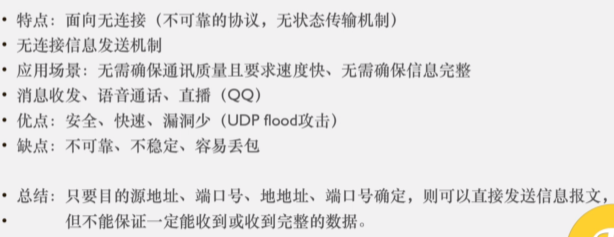
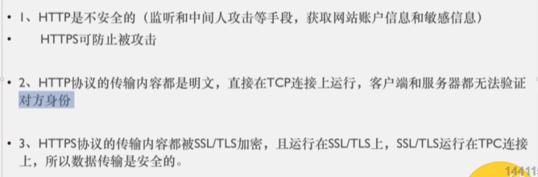

https://www.bilibili.com/video/BV1bk4y1m7zC

https://ke.qq.com/user/index/index.html#/plan/cid=2837895&term_id=102948532 买的课程

# 1. 服务器搭建与相关操作

wampServer

xampp

14min处

# [2. 网络初探 URL 客户端与服务端 域名操作](https://ke.qq.com/webcourse/2837895/102948532#taid=10038614178876807&vid=5285890787800102052)

5min开始

## 2.1 浏览器请求一个网页的流程

即输入网址，敲回车，发生了什么？

1. DNS解析（将网址转成IP地址）
2. TCP/IP三次握手，建立TCP连接
3. 发起HTTP请求
4. 浏览器得到HTML代码，并解析HTML代码

5. 请求下载HTML中的静态资源，渲染页面
6. 四次挥手，中断连接请求

## 2.2 URI Uniform Resource Identifer

28min处

**统一资源标识符**

用来唯一的标识一个资源

- URI只是资源标识

## 2.3 URL Uniform Resource Locator

**统一资源定位符**

URL可以用来标识一个资源，而且还指明了如何定位这个资源

用地址定义一个资源

- URL 是资源标识
- URL 具有定位资源的功能
- URL 指明了获取资源所采用的协议

URL：协议名称 + 主机名称 + 端口 + 路径 + 文件 + 查询所需字符串

## 2.4 URN Uniform Resource Name

**统一资源命名**

用名称定位一个资源

URN：主机名称 + 端口 + 路径 + 文件 + 查询所需字符串

==URL肯定是一个URI，URI并不一定是URL，也可能是URN==

## 2.5 CS架构与BS架构

## 2.6 域名

1小时26min处

# [3. DNS IP TCP/UDP HTTP/HTTPS 三次握手](https://ke.qq.com/webcourse/2837895/102948532#taid=10038618473844103&vid=5285890788393511851)

## 3.1 www World Wide Web 万维网

## 3.2 DNS解析过程

 18min处

Domain Name Server 域名服务器

- DNS本地服务器：运营商。例如：电信，移动，长城等

https://www.sfn.cn/news/technology/detail/222.html?navId=22

## 3.3 IP  Internet Protocol Address

38min处

互联网协议地址

IP又称为互联网协议

什么协议呢？——是分配给用户上网使用的互联网协议

为什么说IP是协议呢？——也就是说IP是有一定的规范的

## 3.4 IP端口号PORT

47min处

## 3.5 TCP Transmission Control Protocol

52min处

传输控制协议

## 3.6 UDP User Data Protocol

1h2min处

用户数据报协议

## 3.7 HTTP与HTTPS Hyper Text Transfer Protocol

- HTML：超文本标记语言 Hyper Text Mark Language
- HTTP：超文本传输协议 Hyper Text Transfer Protocol——客户端和服务器端请求和应答的标准，**用于从WEB服务器传输超文本到本地浏览器的传输协议**
- HTTPS：超文本传输安全协议 Hyper Text Transfer Protocol Secure

- HTTP与HTTPS本质上是一样的， HTTPS在HTTP的基础上加了一层安全层。  HTTPS是HTTP的安全版。（安全基础是SSL/TLS）

- http不安全的原因是什么？

  - 是由于http在请求的过程中，很多东西是明文的，比如http请求头

   

- **SSL**： 安全套接层 Secure Sockets Layer

- **TLS**： 传输层安全 Transport Layer Security（对SSL进行了升级）

- http与https的区别：

  - 

  - 第二点中：客户端和服务器都无法验证对方身份。 只能靠标识位。 但是标识位有可能被篡改

---

## 3.8 建立TCP连接的前奏

1h25min处

标志位：即数据包

- SYN：Synchronize Sequence Numbers 同步序列编号
- ACK：Acknowledgement 确认字符

状态：

- LISTEN：监听TCP端口的连接请求（我等着你发送连接请求呢）
- SYN-SENT：发送了标识位。在发送连接请求后，等待匹配的连接请求（我发送了连接请求，我等你回复哈）
- SYN-RECEIVED：接收了标识位。在收到和发送一个连接请求后，等待对连接请求的确认（我收到你的连接请求了哈，我等你回复我）
- ESTABLISHED：代表一个打开的连接，数据可以传送给用户

## 3.9 三次握手

- 发送序号是上一次的确认序号

- 确认序号是上一次发送序号加1

# [4. www历史，HTTP报文，请求方式，GET与POST](https://ke.qq.com/webcourse/2837895/102948532#taid=10038622768811399&vid=5285890788031352464)

## 4.1 www （没太听懂）

 30mins～

World Wide Web 万维网

- www以前是一个协议，并不是一个二级域名，是**网页传输协议（网页服务协议）**

## 4.2 HTTP报文前言

57mins～

- 报文：客户端和服务端之间的数据传递
- **HTTP基于TCP/IP通信协议来传递数据**
- 一次请求 服务端要知道 你是什么样的请求

- “限制每次连接只处理一个请求”——这是传统的TCP/IP连接。服务器处理完客户的请求，并收到客户的应答后，即断开连接。采用这种方式可以节省传输时间

## 4.3 HTTP报文

- 一般来说，用post请求的时候，请求体是Form Data——表单数据
- get请求的时候请求体是查询字符串参数——Query String Parameters
- 

  ## 4.4 HTTP报文请求方式 

1h41min~

http 1.1版本中有八种请求方式：

- GET
- POST
- OPTIONS
- HEAD
- PUT：上传资源
- DELETE
- TRACE
- CONNECT

持久化连接 connection: keep-alive

管道化持久连接：

# 第5节 http状态码，accept，Content-Type 

### 304 资源重定向：

### 302重定向：

### 404页面错误：页面不存在（找不到页面或者资源）

### 403服务器拒绝请求forbidden：服务器不给你权限进入

### 500 内部服务器错误

### 503 服务器当前不能处理客户端请求

## Accept 40min  

# 第6节 浏览器缓存 长短连接 Content-Length

缓存到底是怎么运行的？

为什么Cache-Control这个字段在请求头和响应头里面都有？

## 缓存机制：

感觉这个图是错的！！！缓存已经过期了为什么还能304读取缓存呢？？？？？？？？？？？？？？？？？？？？？？？？？？？？

31:10处

## 长短连接：Connection：keep-alive 

在请求头里面

## content-length：

1.GET请求：请求头没有content-length，响应头带content-length。

2.POST请求：请求头与响应头都带content-length

## Referer：来源域名

防盗链！！

# 第7节 http版本，关闭TCP，四次挥手

## HTTP版本 背不住：

### 1.HTTP/0.9

### 2.HTTP/1.0

### 3.HTTP/1.1

### 4.HTTP/2.0

双工模式和管道机制有什么区别？

服务器推送是如何知道要推哪些静态资源的？

---

## 关闭TCP连接的前奏

SYN：synchronize sequence numbers 同步序列编号

FIN：数据包

小写ack：确认FIN包的信息，包里面的数据我已经看过了

大写ACK：指发送的数据包

## 同源策略 1小时25min处

