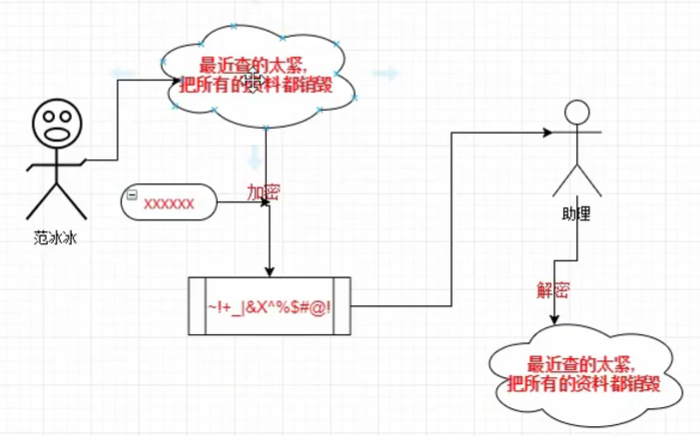
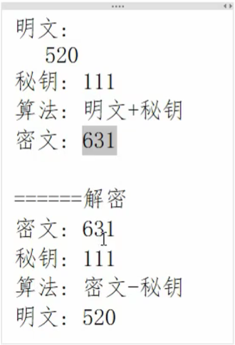

# 1. 非对称加密

https://www.bilibili.com/video/BV134411r7Kt?from=search&seid=8809898301026014150

# 2. 加密

https://www.bilibili.com/video/BV1q7411E7oa?from=search&seid=8809898301026014150# 

# 2. 加密三要素

https://www.bilibili.com/video/BV1QU4y1t7g4?p=2&vd_source=a7089a0e007e4167b4a61ef53acc6f7e

- 在进行网络通信的时候，为什么要加密？
- 
- 
- 加密三要素：
  - 明文/密文
  - 秘钥——定长的字符串
  - 加密算法/解密算法
- 

# [3. 对称和非对称加密的特点](https://www.bilibili.com/video/BV1QU4y1t7g4?p=3&spm_id_from=pageDriver&vd_source=a7089a0e007e4167b4a61ef53acc6f7e)

- 对称加密
  - 秘钥：加密和解密的时候用的是同一个秘钥
- 非对称加密
  - 秘钥：加密和解密的时候用的不是同一个秘钥，秘钥有两个，需要使用秘钥生成算法，得到密钥对
    - 公钥——可以公开
      - 公钥加密数据，私钥解密数据
    - 私钥——需要妥善保管
      - 私钥加密数据，公钥解密
  - 

