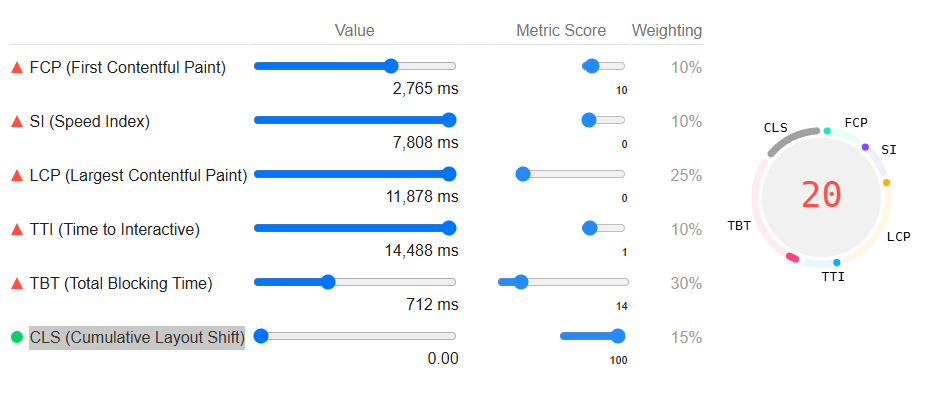
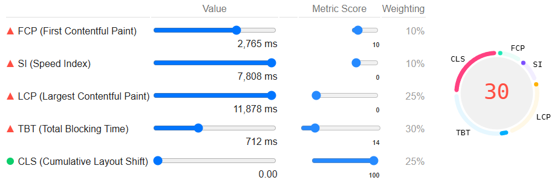
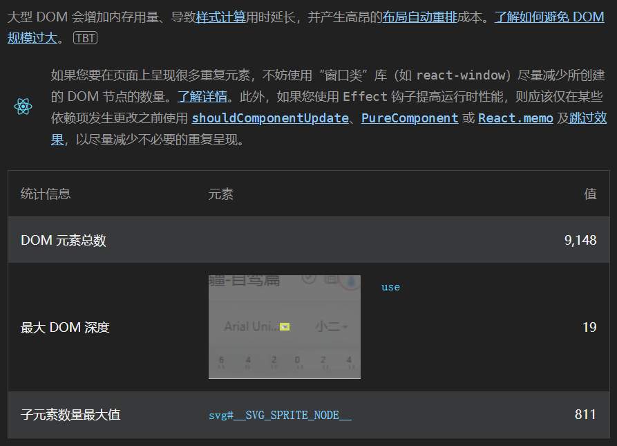

# 1. v8 VS v10

|                                |       | V8   | V10  |
| ------------------------------ | ----- | ---- | ---- |
| FCP (First Contentful Paint)   | 2.8s  | 10%  | 10%  |
| SI (Speed Index)               | 7.8s  | 10%  | 10%  |
| LCP (Largest Contentful Paint) | 11.9s | 25%  | 25%  |
| TTI (Time to Interactive)      |       | 10%  |      |
| TBT (Total Blocking Time)      | 710ms | 30%  | 30%  |
| CLS (Cumulative Layout Shift)  | 0     | 15%  | 25%  |

| v8                                                           | v10                                                          |
| ------------------------------------------------------------ | ------------------------------------------------------------ |
|  |  |

# 2. 避免DOM规模过大

9148个元素

大型 DOM 会增加内存用量、导致[样式计算](https://developers.google.com/web/fundamentals/performance/rendering/reduce-the-scope-and-complexity-of-style-calculations?utm_source=lighthouse&utm_medium=devtools)用时延长，并产生高昂的[布局自动重排](https://developers.google.com/speed/articles/reflow?utm_source=lighthouse&utm_medium=devtools)成本。[了解如何避免 DOM 规模过大](https://developer.chrome.com/docs/lighthouse/performance/dom-size/?utm_source=lighthouse&utm_medium=devtools)

如果您要在页面上呈现很多重复元素，不妨使用“窗口类”库（如 `react-window`）尽量减少所创建的 DOM 节点的数量。[了解详情](https://web.dev/virtualize-long-lists-react-window/?utm_source=lighthouse&utm_medium=devtools)。此外，如果您使用 `Effect` 钩子提高运行时性能，则应该仅在某些依赖项发生更改之前使用 [`shouldComponentUpdate`](https://reactjs.org/docs/optimizing-performance.html?utm_source=lighthouse&utm_medium=devtools#shouldcomponentupdate-in-action)、[`PureComponent`](https://reactjs.org/docs/react-api.html?utm_source=lighthouse&utm_medium=devtools#reactpurecomponent) 或 [`React.memo`](https://reactjs.org/docs/react-api.html?utm_source=lighthouse&utm_medium=devtools#reactmemo) 及[跳过效果](https://reactjs.org/docs/hooks-effect.html?utm_source=lighthouse&utm_medium=devtools#tip-optimizing-performance-by-skipping-effects)，以尽量减少不必要的重复呈现